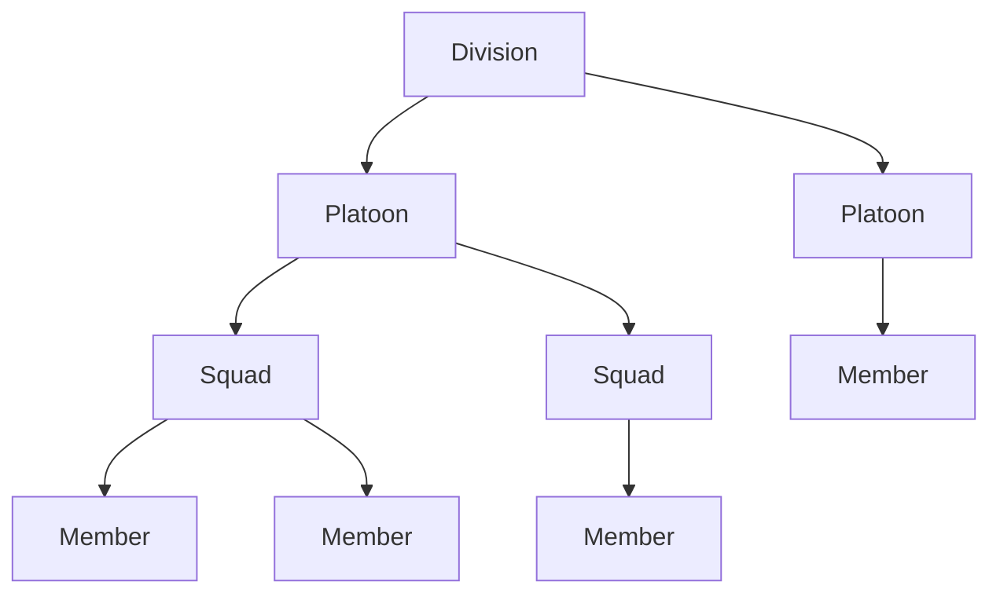

#  AOD Tracker v3

A member and organizational unit management system for the AOD gaming community.

**Tech Stack:** Laravel 12 · PHP 8.4 · Vue.js 3 · MariaDB · Filament v4



The Tracker consumes member data from external systems (AOD forums, Discord bot) and provides analytics for recruiting, retention, and activity.

## Local Development

Requires [Docker](https://www.docker.com/) or Docker Desktop.

### Quick Start

```bash
# Install dependencies (if PHP not installed locally)
docker run --rm \
    -u "$(id -u):$(id -g)" \
    -v "$(pwd):/var/www/html" \
    -w /var/www/html \
    laravelsail/php84-composer:latest \
    composer install --ignore-platform-reqs

# Or with local PHP/Composer
composer install

# Setup environment
cp .env.example .env
php artisan key:generate

# Start containers
./vendor/bin/sail up -d

# Setup database
./vendor/bin/sail artisan migrate:fresh \
    && ./vendor/bin/sail artisan db:seed \
    && ./vendor/bin/sail artisan db:seed --class=ClanSeeder

# Build frontend assets
./vendor/bin/sail npm install
./vendor/bin/sail npm run build
```

The app auto-logs into a seeded user for local development.

### Common Commands

```bash
./vendor/bin/sail artisan test          # Run tests
./vendor/bin/sail tinker                # Laravel REPL
./vendor/bin/pint                       # Format code
```

## Contributing

Fork the repo, follow the setup steps above, then submit a PR. Run `./vendor/bin/pint` before committing to maintain consistent code style.
